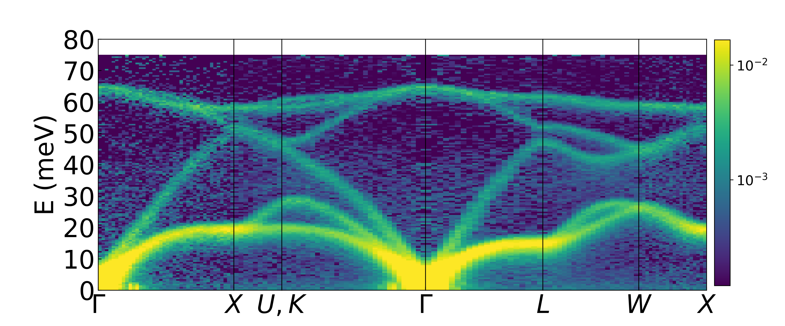

# pathSQE
The pathSQE software automates the analysis of single-crystal inelastic neutron scattering datasets collected with time-of-flight instruments. It enables systematic slicing, symmetrization, and visualization of data in reciprocal space, facilitating the exploration of large wavevector–energy volumes and comparisons with theoretical predictions

## Getting Started
### 1. Clone the repository

On any system with Git installed:

git clone https://github.com/delaire-lab-duke/pathSQE.git

Alternatively, you can download and transfer the repository as a ZIP file.

### 2. Set up the environment
For experimental data analysis (no simulations required):

conda activate mantid

(If a mantid environment doesn't already exist, create one with: conda create -n mantid -c mantid mantid)

For full functionality including phonon simulations, create a new conda environment:

conda create -n pathSQE -c conda-forge -c mantid mantid phonopy

conda activate pathSQE

### 3. Specify your dataset
Edit define_data.py to point to your data.

If run on the ORNL SNS analysis cluster, the provided version works out-of-the-box with a publicly available Si dataset measured at 300 K on ARCS at the SNS.

### 4. Set analysis parameters
Edit pathSQE_input.py to configure the desired slicing paths, symmetry settings, temperature conditions, and output options.

### 5. Run the workflow
From the terminal, run:

python pathSQE_driver.py

## Example Output

An example of a symmetrized, folded I(q,E) from the publicly available Si dataset at 300K:

## Citing pathSQE

If you use pathSQE in your research, please cite the following:

> Aiden Sable, Andrei T. Savici, and Olivier Delaire.  
> *pathSQE: An automated workflow for single-crystal inelastic neutron scattering data processing and analysis*.  
> arXiv:XXXX.XXXXX [cond-mat.mtrl-sci], 2025.  

BibTeX:
@article{sable2025pathsqe,
  title={pathSQE: An automated workflow for single-crystal inelastic neutron scattering data processing and analysis},
  author={Sable, Aiden and Savici, Andrei T. and Delaire, Olivier},
  journal={arXiv preprint arXiv:XXXX.XXXXX},
  year={2025}
}
